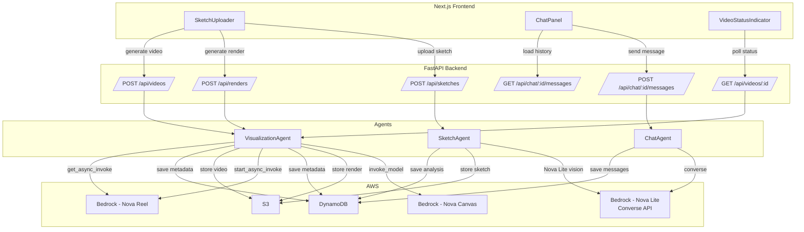
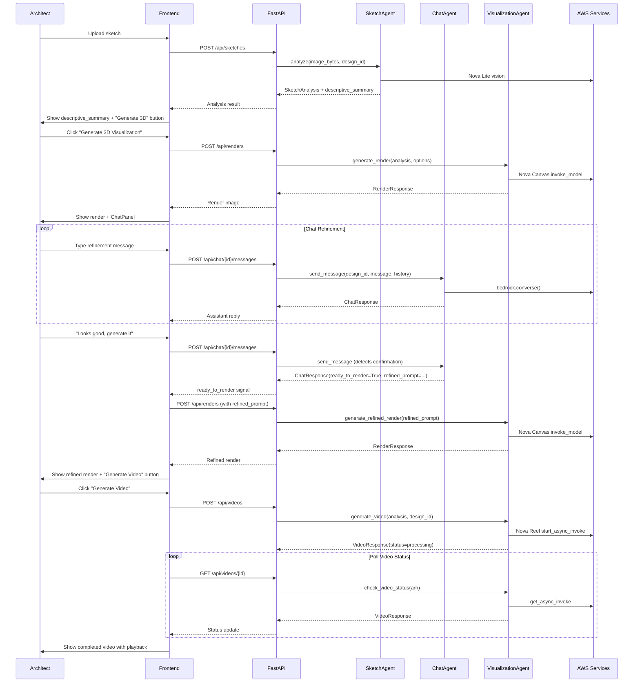

# Design Document: Sketch-to-Video Workflow

## Overview

This design extends DraftBridge with a complete sketch-to-video pipeline. The workflow adds three capabilities to the existing architecture:

1. **Enhanced sketch analysis** — SketchAgent produces a `descriptive_summary` (human-readable paragraph) alongside the existing structured analysis, so architects can verify the AI understood their design.
2. **Chat-based design refinement** — A new `ChatAgent` uses the Bedrock Converse API (`bedrock.converse()`) for multi-turn conversations. The agent accumulates design refinements through conversation and only constructs a final render prompt when the user confirms readiness.
3. **End-to-end UI flow** — The frontend gains a `ChatPanel` component for refinement and a `VideoStatusIndicator` for polling Nova Reel jobs, stitching the stages (analysis → render → chat → refined render → video) into a seamless workflow.

Key design decision: the chat collects refinements conversationally and produces a single `Refined_Prompt` on confirmation, avoiding wasteful intermediate renders. The Converse API is used (not `invoke_model`) because it natively manages multi-turn message history.

## Architecture



### Workflow Sequence




## Components and Interfaces

### 1. ChatAgent (New — `app/agents/chat_agent.py`)

Inherits `BaseAgent`. Adds a `converse_bedrock()` method that wraps `bedrock.converse()` with retry logic (the Converse API has a different request/response shape than `invoke_model`).

```python
class ChatAgent(BaseAgent):
    def converse_bedrock(self, model_id: str, messages: list[dict], system: list[dict], inference_config: dict) -> dict:
        """Invoke Bedrock Converse API with retry. Returns the full response dict."""
        ...

    def send_message(self, design_id: str, user_message: str, descriptive_summary: str) -> ChatResponse:
        """
        1. Load conversation history from DynamoDB (CHAT# items under DESIGN#{design_id})
        2. Append user message to history
        3. Build system prompt with descriptive_summary and refinement instructions
        4. Call converse_bedrock() with full message history
        5. Parse response — detect if user confirmed design (ready_to_render)
        6. If confirmed, construct refined_prompt from summary + accumulated refinements
        7. Save both user and assistant messages to DynamoDB
        8. Return ChatResponse
        """
        ...

    def get_history(self, design_id: str) -> list[ChatMessage]:
        """Load full conversation history from DynamoDB, ordered by SK."""
        ...

    def _build_system_prompt(self, descriptive_summary: str) -> list[dict]:
        """Build the Converse API system parameter with architectural context."""
        ...

    def _detect_confirmation(self, assistant_text: str, user_message: str) -> bool:
        """Heuristic + LLM-assisted detection of user confirming the design."""
        ...

    def _build_refined_prompt(self, descriptive_summary: str, messages: list[dict]) -> str:
        """Extract accumulated refinements from conversation and combine with original summary."""
        ...
```

**System prompt strategy**: The system prompt includes the `descriptive_summary` from sketch analysis as architectural context, plus instructions for the agent to:
- Acknowledge design changes and explain their impact
- Suggest improvements based on BIM rules, lighting, and infrastructure guidelines
- Track refinements as a running list
- Signal readiness when the user confirms

**Confirmation detection**: The `_detect_confirmation` method uses keyword matching (e.g., "generate it", "looks good", "go ahead") as a first pass. If ambiguous, the Converse API response itself includes a structured signal — the system prompt instructs the model to include `[READY_TO_RENDER]` in its response when the user confirms.

### 2. SketchAgent Enhancement (Modified — `app/agents/sketch_agent.py`)

The existing `analyze()` method is extended to produce a `descriptive_summary` field. After the structured analysis is complete, a second prompt asks Nova Lite to generate a natural-language paragraph summarizing the detected rooms, elements, materials, and spatial layout.

```python
# Addition to SketchAgent.analyze():
def _generate_descriptive_summary(self, analysis: SketchAnalysis) -> str:
    """Generate a human-readable summary from structured analysis data.
    
    Calls Nova Lite with a prompt that references the rooms, elements,
    and spatial relationships. Returns empty string on failure (graceful degradation).
    """
    ...
```

The `SketchAnalysis` model gains a new optional field:
```python
descriptive_summary: str = ""
```

### 3. VisualizationAgent Enhancement (Modified — `app/agents/visualization_agent.py`)

A new `generate_refined_render()` method accepts a pre-built prompt string directly, bypassing the normal `build_render_prompt()` flow:

```python
def generate_refined_render(self, refined_prompt: str, design_id: str) -> RenderResponse:
    """Generate a render using a pre-built refined prompt from chat refinement.
    
    Same Nova Canvas invocation as generate_render(), but uses the prompt as-is
    instead of building one from SketchAnalysis + RenderRequest.
    """
    ...
```

### 4. Chat Router (New — `app/routers/chat.py`)

```python
router = APIRouter(prefix="/api/chat", tags=["chat"])

@router.post("/{design_id}/messages", response_model=ChatResponse)
async def send_message(design_id: str, request: ChatMessageRequest, ...):
    """Send a user message and get the ChatAgent response.
    Validates design_id exists. Returns ready_to_render + refined_prompt when confirmed."""
    ...

@router.get("/{design_id}/messages", response_model=ChatHistoryResponse)
async def get_messages(design_id: str, ...):
    """Load full conversation history for a design session."""
    ...
```

### 5. Chat Models (New — `app/models/chat.py`)

```python
class ChatMessageRequest(BaseModel):
    message: str

class ChatMessage(BaseModel):
    message_id: str
    design_id: str
    role: str  # "user" | "assistant"
    content: str
    created_at: datetime

class ChatResponse(BaseModel):
    message: ChatMessage
    ready_to_render: bool = False
    refined_prompt: str | None = None

class ChatHistoryResponse(BaseModel):
    design_id: str
    messages: list[ChatMessage]
```

### 6. DatabaseService Extensions (Modified — `app/services/database_service.py`)

New methods for chat message persistence:

```python
def save_chat_message(self, design_id: str, message_id: str, role: str, content: str) -> None:
    """Save a chat message. PK=DESIGN#{design_id}, SK=CHAT#{message_id}."""
    ...

def get_chat_messages(self, design_id: str) -> list[dict]:
    """Query all CHAT# items under a design, ordered by SK (which encodes timestamp)."""
    ...
```

### 7. Frontend Components

**ChatPanel.tsx** (New — `frontend/src/components/ChatPanel.tsx`):
- Displays conversation messages with visual distinction (user right-aligned, assistant left-aligned)
- Text input with send button
- Loading indicator while waiting for response
- Detects `ready_to_render` in response and triggers refined render generation
- Loads existing history on mount via GET endpoint

**VideoStatusIndicator.tsx** (New — `frontend/src/components/VideoStatusIndicator.tsx`):
- Polls `GET /api/videos/{video_id}` at 5-second intervals
- Shows progress states: "Processing...", "Complete", "Failed"
- On completion, renders `<video>` element with playback controls
- On failure, shows error message with retry button

**SketchUploader.tsx** (Modified):
- After analysis: display `descriptive_summary` above structured data
- After initial render: show `ChatPanel` alongside the render
- After refined render: show "Generate Video" button
- Workflow stage indicator (analysis → render → chat → refined render → video)
- Loading states and button disabling during generation

### 8. Dependencies (Modified — `app/dependencies.py`)

```python
def get_chat_agent(
    bedrock=Depends(get_bedrock_client),
    storage=Depends(get_storage_service),
    db=Depends(get_database_service),
) -> ChatAgent:
    return ChatAgent(bedrock, storage, db)
```


## Data Models

### DynamoDB Schema (Chat Messages)

Follows the existing single-table design pattern:

| PK | SK | Attributes |
|---|---|---|
| `DESIGN#{design_id}` | `CHAT#{timestamp}#{message_id}` | `message_id`, `design_id`, `role`, `content`, `created_at` |

The SK encodes an ISO-8601 timestamp prefix so that a `begins_with("CHAT#")` query returns messages in chronological order. The `message_id` (UUID) suffix ensures uniqueness even if two messages share the same second.

### Updated SketchAnalysis Model

```python
class SketchAnalysis(BaseModel):
    design_id: str
    rooms: list[Room]
    architectural_elements: list[ArchitecturalElement]
    text_annotations: list[TextBlock]
    spatial_relationships: list[dict[str, str]]
    raw_dimensions: dict[str, Any] = {}
    descriptive_summary: str = ""  # NEW — human-readable paragraph
    analyzed_at: datetime
```

### Chat Pydantic Models

```python
class ChatMessageRequest(BaseModel):
    message: str  # Non-empty, validated

class ChatMessage(BaseModel):
    message_id: str
    design_id: str
    role: str       # "user" | "assistant"
    content: str
    created_at: datetime

class ChatResponse(BaseModel):
    message: ChatMessage
    ready_to_render: bool = False
    refined_prompt: str | None = None

class ChatHistoryResponse(BaseModel):
    design_id: str
    messages: list[ChatMessage]
```

### Bedrock Converse API Message Format

The ChatAgent translates between the DynamoDB `ChatMessage` format and the Converse API format:

```python
# Converse API expects:
{
    "role": "user" | "assistant",
    "content": [{"text": "message content"}]
}

# System parameter:
[{"text": "You are an architectural design assistant..."}]
```

### RenderRequest Extension

The existing `RenderRequest` model gains an optional field for refined renders:

```python
class RenderRequest(BaseModel):
    design_id: str
    style: str = "photorealistic"
    materials: dict[str, str] | None = None
    lighting: str = "natural"
    resolution: str = "1024x1024"
    refined_prompt: str | None = None  # NEW — pre-built prompt from chat refinement
```

When `refined_prompt` is provided, the renders router passes it directly to `generate_refined_render()` instead of building a prompt from analysis data.


## Correctness Properties

*A property is a characteristic or behavior that should hold true across all valid executions of a system — essentially, a formal statement about what the system should do. Properties serve as the bridge between human-readable specifications and machine-verifiable correctness guarantees.*

### Property 1: Descriptive summary references analysis content

*For any* valid `SketchAnalysis` containing at least one room and one architectural element, the generated `descriptive_summary` should be a non-empty string that contains every room name from the analysis and at least one architectural element type.

**Validates: Requirements 1.1, 1.2**

### Property 2: Summary failure graceful degradation

*For any* sketch analysis where the descriptive summary generation step raises an exception, the returned `SketchAnalysis` should still contain valid structured data (rooms, elements, text_annotations) and `descriptive_summary` should equal the empty string.

**Validates: Requirements 1.4**

### Property 3: Full conversation history sent to Converse API

*For any* design session with N prior messages in the conversation history, when a new user message is sent, the Bedrock Converse API call should receive exactly N+1 messages (all prior messages plus the new user message) in chronological order.

**Validates: Requirements 2.1**

### Property 4: Chat message persistence round-trip

*For any* sequence of user and assistant messages saved to DynamoDB for a design session, loading the conversation history should return all messages in chronological order with correct role, content, and design_id, using the single-table key pattern PK=DESIGN#{design_id} and SK beginning with CHAT#.

**Validates: Requirements 2.4, 3.1, 3.2, 3.3, 3.4**

### Property 5: Confirmation produces render signal with refined prompt

*For any* conversation where the user sends a confirmation message (containing phrases like "looks good", "generate it", "go ahead"), the ChatAgent response should have `ready_to_render=True` and a non-empty `refined_prompt` that incorporates content from the original descriptive summary.

**Validates: Requirements 2.5, 6.4**

### Property 6: API failure preserves conversation history

*For any* conversation state in DynamoDB, if the Bedrock Converse API call fails with an exception, the conversation history in DynamoDB should remain unchanged (no messages added or removed) compared to before the failed call.

**Validates: Requirements 2.8**

### Property 7: Refined prompt passthrough to Nova Canvas

*For any* non-empty refined prompt string, when `generate_refined_render()` is called, the prompt passed to Nova Canvas `invoke_model` should be identical to the input refined prompt string.

**Validates: Requirements 4.2**

### Property 8: Render metadata persistence

*For any* successfully generated refined render, the S3 bucket should contain the render image at the expected key, and DynamoDB should contain a RENDER# item with matching render_id, design_id, s3_key, and prompt_used fields.

**Validates: Requirements 4.3**

### Property 9: Video generation parameters invariant

*For any* video generation request, the body sent to Nova Reel `start_async_invoke` should specify `durationSeconds=6`, `fps=24`, and `dimension="1280x720"`.

**Validates: Requirements 5.2**

### Property 10: Video metadata persistence on completion

*For any* video generation job that completes successfully, the DynamoDB VIDEO# item should be updated with `status="complete"` and a non-empty `s3_key`.

**Validates: Requirements 5.5**

### Property 11: Non-existent design returns 404

*For any* randomly generated UUID that does not correspond to an existing design in DynamoDB, both `POST /api/chat/{design_id}/messages` and `GET /api/chat/{design_id}/messages` should return HTTP 404.

**Validates: Requirements 6.3, 6.5**


## Error Handling

### ChatAgent Errors

| Error Scenario | Handling | User Impact |
|---|---|---|
| Bedrock Converse API throttled | Retry with exponential backoff (same pattern as BaseAgent) | Slight delay, transparent to user |
| Bedrock Converse API failure (after retries) | Raise `AWSServiceError`, preserve conversation history | Error message in ChatPanel, user can retry |
| Empty response from Converse API | Return a fallback message ("I couldn't process that, please try again") | User sees fallback, can resend |
| Invalid design_id on chat endpoint | `DesignNotFoundError` (404) | Frontend shows error |
| Empty message body | Pydantic validation error (422) | Frontend prevents empty sends |

### SketchAgent Summary Errors

| Error Scenario | Handling | User Impact |
|---|---|---|
| Summary generation fails | Catch exception, set `descriptive_summary=""` | User sees structured analysis only, no summary paragraph |
| Summary generation returns empty | Set `descriptive_summary=""` | Same as above |

### VisualizationAgent Errors

| Error Scenario | Handling | User Impact |
|---|---|---|
| Nova Canvas fails on refined render | Raise `AWSServiceError` | Frontend shows error, retry button enabled |
| Nova Reel async invocation fails | Raise `AWSServiceError` | VideoStatusIndicator shows error with retry |
| Nova Reel job status = "Failed" | Update DynamoDB status to "failed", return failed VideoResponse | VideoStatusIndicator shows failure with retry |
| Presigned URL generation fails | Raise `AWSServiceError` | Frontend shows error |

### DynamoDB Errors

| Error Scenario | Handling | User Impact |
|---|---|---|
| Chat message save fails | Raise `AWSServiceError` | Error message, user can retry sending |
| Chat history load fails | Raise `AWSServiceError` | ChatPanel shows error, user can refresh |

All errors follow the existing `DraftBridgeError` hierarchy and are caught by the global exception handlers in `main.py`.

## Testing Strategy

### Property-Based Testing (Hypothesis)

Each correctness property maps to a single Hypothesis property test in `tests/test_properties/`. Tests use `@given` decorators with custom strategies for generating:

- Random `SketchAnalysis` instances (rooms with names, elements with types)
- Random conversation histories (lists of user/assistant messages)
- Random UUIDs for design_id, message_id
- Random prompt strings for refined renders

Configuration:
- Minimum 100 examples per property test (`@settings(max_examples=100)`)
- Each test tagged with a comment: `# Feature: sketch-to-video-workflow, Property N: <title>`
- AWS services mocked with `moto` (`mock_aws` context manager)
- Bedrock calls mocked with `unittest.mock.patch`

Property test file: `tests/test_properties/test_sketch_to_video_properties.py`

### Unit Tests

Unit tests complement property tests by covering specific examples, edge cases, and integration points:

**`tests/test_agents/test_chat_agent.py`**:
- Confirmation detection with various phrasings ("looks good", "generate it", "let's go", "ready")
- System prompt includes descriptive_summary
- Converse API message format correctness
- Error handling when Bedrock fails

**`tests/test_agents/test_sketch_agent_summary.py`**:
- Summary generation with minimal analysis (one room, no elements)
- Summary generation with complex analysis (multiple rooms, many elements)
- Graceful degradation when Nova Lite fails

**`tests/test_agents/test_visualization_refined.py`**:
- Refined render with a specific prompt string
- Refined render stores metadata correctly
- Error propagation from Nova Canvas

**`tests/test_routers/test_chat_router.py`**:
- POST with valid design_id returns 200 with ChatResponse
- POST with non-existent design_id returns 404
- GET returns empty list for design with no messages
- GET returns messages in chronological order
- POST with empty message body returns 422

**`tests/test_services/test_database_chat.py`**:
- Save and retrieve single message
- Save multiple messages and verify order
- Query returns empty list for design with no chat messages

### Test Infrastructure

- All AWS services mocked via `moto` (S3, DynamoDB) and `unittest.mock` (Bedrock)
- Shared fixtures in `tests/conftest.py` extended with `mock_bedrock_converse` fixture
- HTTP tests use `httpx.AsyncClient` with `ASGITransport` against the FastAPI app
- Test directory structure mirrors `app/` layout

